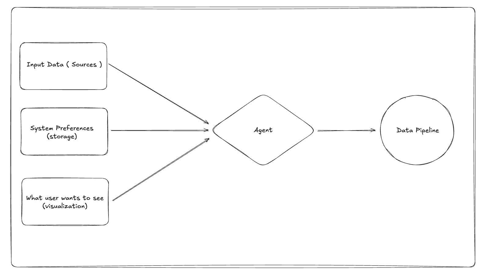
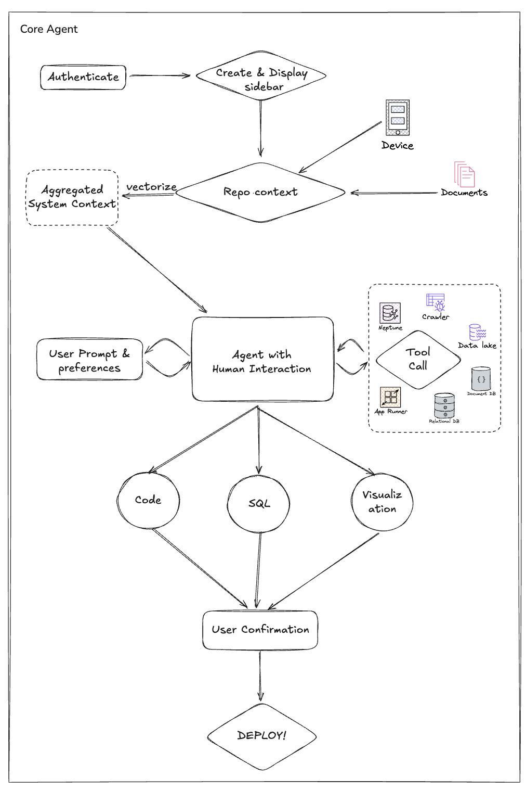
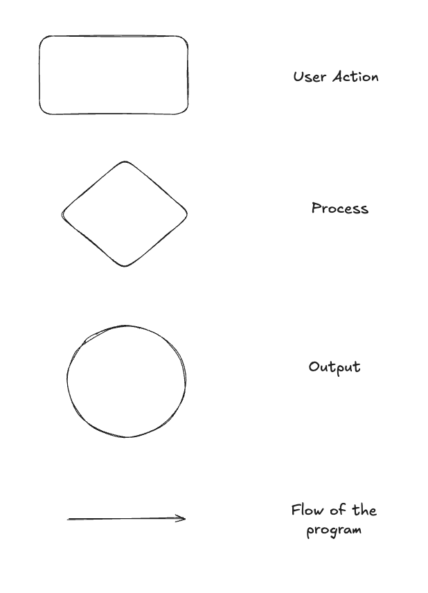

# Senior Design — Final Fall Design Report

## Table of Contents

- [Datagrep User Guide & Manual](#datagrep-user-guide--manual)
  - [Introduction](#introduction)
  - [Installation & Setup](#installation--setup)
  - [Quickstart Guide](#quickstart-guide)
  - [Using the Web Interface](#using-the-web-interface)
  - [Using the Slack Bot](#using-the-slack-bot)
  - [Troubleshooting](#troubleshooting)
  - [FAQ](#faq)
  - [Additional Resources](#additional-resources)
- [Team & Project Abstract](#team--project-abstract)
- [Project Description (Assignment #2)](#project-description-assignment-2)
- [User Stories and Design Diagrams (Assignment #4)](#user-stories-and-design-diagrams-assignment-4)
  - [User Stories](#user-stories)
  - [Design Diagrams: Level 0, Level 1, Level 2](#design-diagrams-level-0-level-1-level-2)
  - [Diagram Conventions & Purpose](#diagram-conventions--purpose)
- [Project Tasks and Timeline (Assignments #5-6)](#project-tasks-and-timeline-assignments-5-6)
  - [Task List](#task-list)
  - [Timeline](#timeline)
  - [Effort Matrix](#effort-matrix)
- [ABET Concerns Essay (Assignment #7)](#abet-concerns-essay-assignment-7)
- [PPT Slideshow (includes ABET Concerns) (Assignment #8)](#ppt-slideshow-includes-abet-concerns-assignment-8)
- [Self-Assessment Essays (Assignment #3)](#self-assessment-essays-assignment-3)
- [Professional Biographies (Assignment #1)](#professional-biographies-assignment-1)
- [Budget](#budget)
- [Appendix](#appendix)
  - [Summary of Hours and Justification](#summary-of-hours-and-justification)


## Datagrep User Guide & Manual

Welcome to the Datagrep User Guide! This manual provides step-by-step instructions for installing, configuring, and using the Datagrep platform, including both the web interface and Slack bot integration. It is designed for users of all technical backgrounds.

---


### Introduction
Datagrep is a platform for data exploration, pipeline generation, and visualization. It offers a web interface and a Slack bot for easy interaction with your data.

---

### Installation & Setup

**Prerequisites**
- [Docker](https://www.docker.com/get-started) installed
- [Git](https://git-scm.com/downloads) installed
- API keys for required services (see below)

**Steps**
1. **Clone the repository:**
  ```sh
  git clone https://github.com/your-org/datagrep.git
  cd datagrep
  ```
2. **Set up environment variables:**
  - Copy `env.example` to `.env` in the backend directory and fill in your API keys.
3. **Start the services:**
  ```sh
  docker-compose up --build
  ```
4. **Access the web app:**
  - Open your browser and go to [http://localhost:3000](http://localhost:3000)

---

### Quickstart Guide
- After starting the services, visit the web interface.
- Log in or sign up if required.
- Upload your data or connect to a data source.
- Use the dashboard to explore, query, and visualize your data.

---

### Using the Web Interface

1. **Home Page:**
  - Overview of features and recent activity.
2. **Data Upload:**
  - Click 'Upload' to add new datasets.
3. **Query Builder:**
  - Use the query builder to create and run data queries.
4. **Visualization:**
  - Generate charts and graphs from your data.

*Screenshot placeholders:*
- 
- 
- 

---

### Using the Slack Bot

1. **Add the Slack bot to your workspace.**
2. **Configure environment variables as described in `datagrep/SLACK_BOT_README.md`.**
3. **Interact with the bot:**
  - Use `/datagrep` commands in Slack to query data, generate pipelines, or request visualizations.

*Screenshot placeholder:*
- 

---

### Troubleshooting
- **Docker won’t start:** Ensure Docker Desktop is running.
- **Web app not loading:** Check that all containers are up (`docker ps`).
- **Slack bot not responding:** Verify environment variables and Slack permissions.
- For more, see [datagrep/SETUP.md](datagrep/SETUP.md) and [datagrep/SLACK_BOT_README.md](datagrep/SLACK_BOT_README.md).

---

### FAQ

**Q: Do I need coding experience to use Datagrep?**
A: No, the web interface is designed for all users. Advanced features may require some data knowledge.

**Q: How do I reset my password?**
A: Use the 'Forgot Password' link on the login page.

**Q: Can I use my own data?**
A: Yes, upload your datasets via the web interface.

**Q: What if I get an error about missing API keys?**
A: Double-check your `.env` file in the backend directory.

**Q: How do I update Datagrep?**
A: Pull the latest code and restart the containers.

---

### Additional Resources
- [datagrep/SETUP.md](datagrep/SETUP.md): Advanced setup and troubleshooting
- [datagrep/SLACK_BOT_README.md](datagrep/SLACK_BOT_README.md): Slack bot integration
- [HW_assignments/Shared/User_Stories.md](HW_assignments/Shared/User_Stories.md): User Stories
- [Design_Diagrams/](Design_Diagrams/): Design Diagrams


---

## Team & Project Abstract

**Team:** Kaaustaaub Shankar, Dhiren Mahajan, Jay Kothari  
**Advisor:** Bo Brunton (Pantomath)  
**Abstract:** Datagrep is an AI assistant that converts natural-language analytics requests into end-to-end pipelines. It discovers sources, infers schemas, designs joins/filters, scaffolds tests and deployment, and tracks lineage so analysts get auditable, repeatable pipelines in minutes instead of weeks.

---

## Project Description (Assignment #2)

Datagrep helps non-technical stakeholders and data teams generate and maintain pipelines without hand-written boilerplate. It maps raw sources, infers schemas, builds joins and filters, produces deployable code, and enforces observability guardrails so pipelines are testable, scheduled, and auditable.

---

## User Stories and Design Diagrams (Assignment #4)

### User Stories

- [Shared/User_Stories.md](Shared/User_Stories.md) — perspectives from data engineer, data analyst, head of data, and data scientist.

### Design Diagrams: Level 0, Level 1, Level 2

- [Design_Diagrams/DesignDiagrams.pdf](Design_Diagrams/DesignDiagrams.pdf) (all diagrams)  
- Level 0:   
- Level 1:   
- Level 2: 

### Diagram Conventions & Purpose

- Legend: 
- Detailed packet: [Shared/Assignment4.md](Shared/Assignment4.md) and [Design_Diagrams/DesignDiagrams.docx](Design_Diagrams/DesignDiagrams.docx)
- Each level progressively drills from user-facing request flow (L0) to subsystem interactions and data movement across ingestion, planning, execution, and monitoring (L1–L2).

---

## Project Tasks and Timeline (Assignments #5-6)

### Task List

- Current assignments by team member: [Shared/Tasklist.md](HW_assignments/Shared/Tasklist.md)
### Timeline

- Milestone schedule:   
- Full milestone package: [Shared/Assignment6.pdf](HW_assignments/Shared/Assignment6.pdf)

### Effort Matrix

- Hours and ownership per task: [Shared/effort_matrix.md](HW_assignments/Shared/effort_matrix.md)

---

## ABET Concerns Essay (Assignment #7)

- [Shared/Assignment7.pdf](HW_assignments/Shared/Assignment7.pdf)

---

## PPT Slideshow (includes ABET Concerns) (Assignment #8)

- [Shared/Assignment8.pdf](HW_assignments/Shared/Assignment8.pdf)

---

## Self-Assessment Essays (Assignment #3)

- Kaaustaaub Shankar: [Kaus/Assignment3.md](HW_assignments/Kaus/Assignment3.md) (PDF copy: `Kaus/Assignment 3 for Senior Design.pdf`)
- Dhiren Mahajan: [Dhiren/Assignment3_individual.md](HW_assignments/Dhiren/Assignment3_individual.md)
- Jay Kothari: [Jay/assignment3.md](HW_assignments/Jay/assignment3.md)

---

## Professional Biographies (Assignment #1)

- Kaaustaaub Shankar: [Kaus/Assignment1.md](HW_assignments/Kaus/Assignment1.md)
- Dhiren Mahajan: [Dhiren/Assignment1.md](HW_assignments/Dhiren/Assignment1.md)
- Jay Kothari: [Jay/Assignment1.md](HW_assignments/Jay/Assignment1.md)

---

## Budget

- Expenses to date: none recorded  
- Donated items and values: none recorded

---

## Appendix

### Summary of Hours and Justification

Jay:
- Coming up with project ideas and initial project design: **3 hours**  
- Finding team and advisor: **2 hours**  
- Researching project-related technologies/tools: **4 hours**  
* Market research and finding a project focus: **5 hours**  
- Working on Final Design Report : **5 hours**  
- Meetings (incl. overages) ( 2hr/week * 12 weeks ): **28 hours**  
- Professional Biography: **1 hour**

Kaaustaaub:
- Coming up with project ideas and initial project design: **3 hours**  
- Finding team and advisor: **2 hours**  
- Researching project-related technologies/tools: **4 hours**  
- Finding the right model and designing the orchestrator: **8 hours**  
- Working on Final Design Report : **5 hours**  
- Meetings (incl. overages) ( 2hr/week * 12 weeks ): **28 hours**  
- Professional Biography: **1 hour**

Dhiren:
- Coming up with project ideas and initial project design: **3 hours**  
- Finding team and advisor: **2 hours**  
- Market research and finding a project focus: **5 hours**  
- Working on Final Design Report: **5 hours**  
- Meetings : **28 hours**  
- Professional Biography: **1 hour**  
- Supabase integration planning + UI orchestration prototypes: **5 hours**
