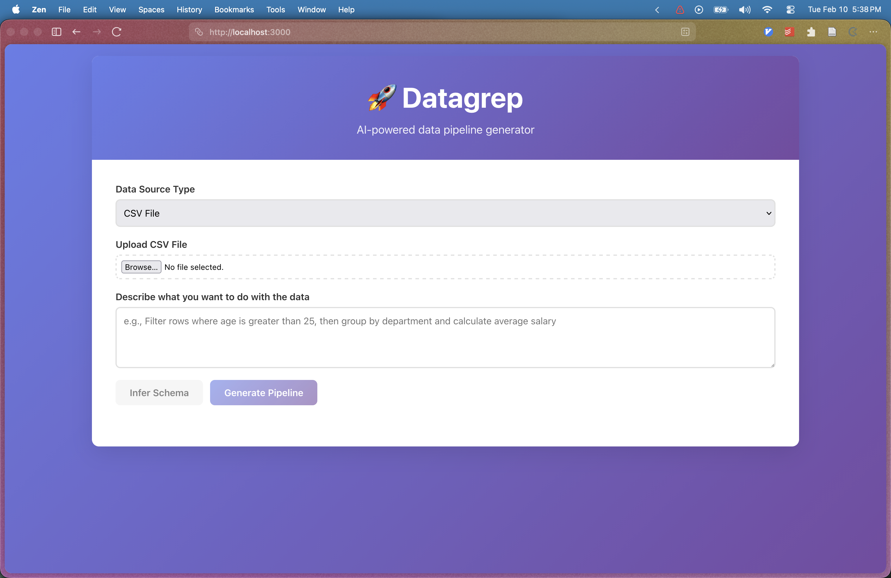
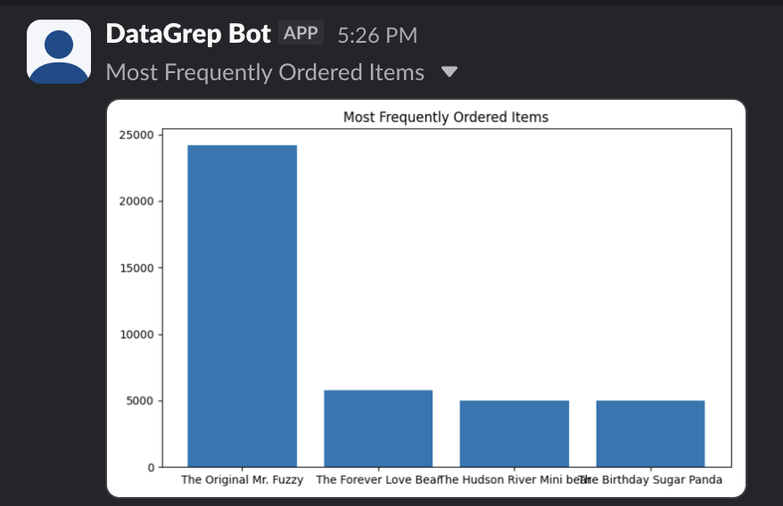
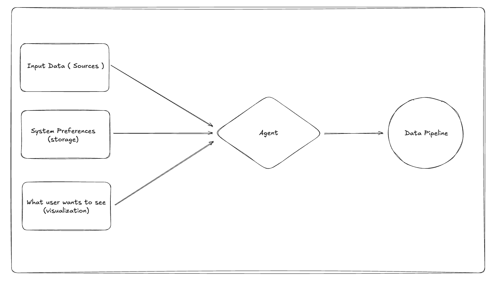
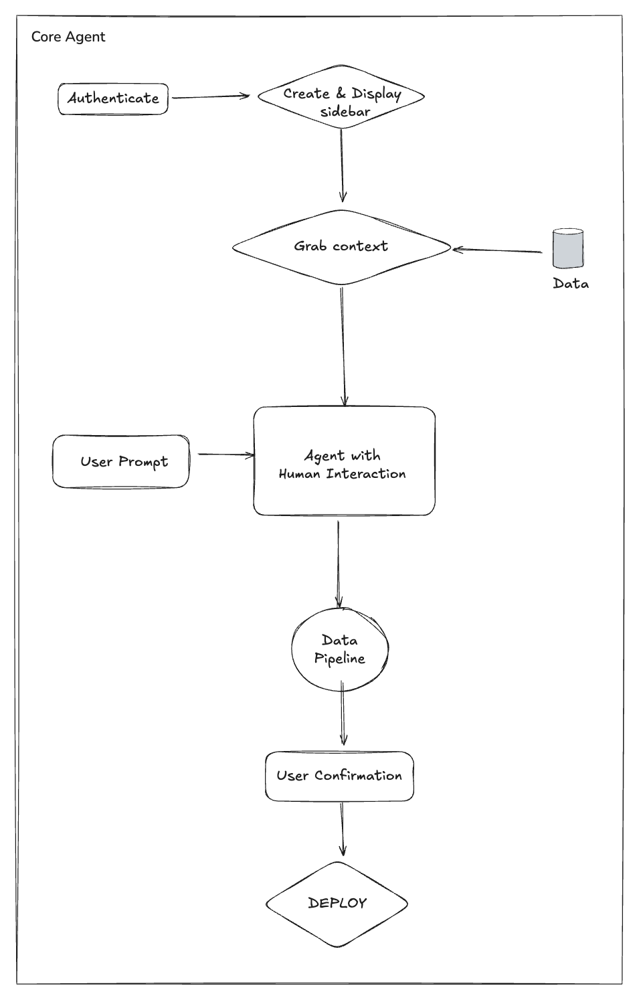
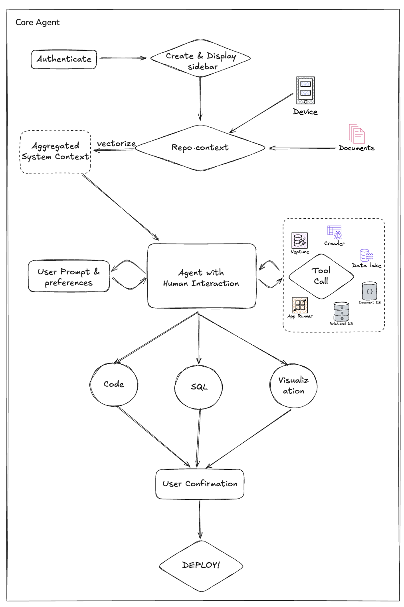
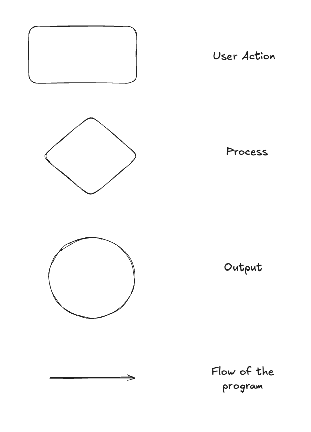
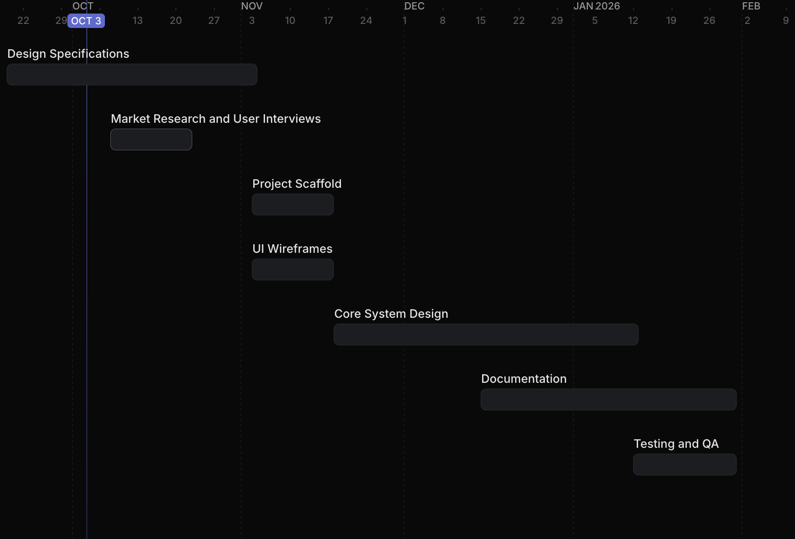

# Senior Design — Final Design Report

## Table of Contents

- [Datagrep User Guide & Manual](#datagrep-user-guide--manual)
  - [Introduction](#introduction)
  - [Installation & Setup](#installation--setup)
  - [Quickstart Guide](#quickstart-guide)
  - [Using the Web Interface](#using-the-web-interface)
  - [Using the Slack Bot](#using-the-slack-bot)
  - [Troubleshooting](#troubleshooting)
  - [FAQ](#faq)
  - [Additional Resources](#additional-resources)
- [Team & Project Abstract](#team--project-abstract)
- [Project Description (Assignment #2)](#project-description-assignment-2)
- [User Stories and Design Diagrams (Assignment #4)](#user-stories-and-design-diagrams-assignment-4)
  - [User Stories](#user-stories)
  - [Design Diagrams: Level 0, Level 1, Level 2](#design-diagrams-level-0-level-1-level-2)
  - [Diagram Conventions & Purpose](#diagram-conventions--purpose)
- [Project Tasks and Timeline (Assignments #5-6)](#project-tasks-and-timeline-assignments-5-6)
  - [Task List](#task-list)
  - [Timeline](#timeline)
  - [Effort Matrix](#effort-matrix)
- [ABET Concerns Essay (Assignment #7)](#abet-concerns-essay-assignment-7)
- [PPT Slideshow (includes ABET Concerns) (Assignment #8)](#ppt-slideshow-includes-abet-concerns-assignment-8)
- [Spring Final PPT Presentation](#spring-final-ppt-presentation)
- [Final Expo Poster](#final-expo-poster)
- [Self-Assessment Essays (Assignment #3)](#self-assessment-essays-assignment-3)
- [Professional Biographies (Assignment #1)](#professional-biographies-assignment-1)
- [Summary of Hours and Justification](#summary-of-hours-and-justification)
- [Summary of Expenses](#summary-of-expenses)
- [Appendix](#appendix)
  - [Implementation Evidence and References](#implementation-evidence-and-references)
  - [Repository, PR, and Meeting Evidence](#repository-pr-and-meeting-evidence)


## Datagrep User Guide & Manual

Welcome to the Datagrep User Guide! This manual provides step-by-step instructions for installing, configuring, and using the Datagrep platform, including both the web interface and Slack bot integration. It is designed for users of all technical backgrounds.

---


### Introduction
Datagrep is a platform for data exploration, pipeline generation, and visualization. It offers a web interface and a Slack bot for easy interaction with your data.

---

### Installation & Setup

**Prerequisites**
- [Docker](https://www.docker.com/get-started) installed
- [Git](https://git-scm.com/downloads) installed
- API keys for required services (see below)

**Steps**
1. **Clone the repository:**
  ```sh
  git clone https://github.com/Jayko001/SeniorDesign.git
  cd datagrep
  ```
2. **Set up environment variables:**
  - Copy `env.example` to `.env` in the backend directory and fill in your API keys.
3. **Start the services:**
  ```sh
  docker-compose up --build
  ```
4. **Access the web app:**
  - Open your browser and go to [http://localhost:3000](http://localhost:3000)

---

### Quickstart Guide
- After starting the services, visit the web interface.
- Log in or sign up if required.
- Upload your data or connect to a data source.
- Use the dashboard to explore, query, and visualize your data.

---

### Using the Web Interface

1. **Home Page:**
  - Overview of features and recent activity.
2. **Data Upload:**
  - Click 'Upload' to add new datasets.
3. **Query Builder:**
  - Use the query builder to create and run data queries.
4. **Visualization:**
  - Generate charts and graphs from your data.

*Screenshot:*
- 
- 

---

### Using the Slack Bot

1. **Add the Slack bot to your workspace.**
2. **Configure environment variables as described in `datagrep/SLACK_BOT_README.md`.**
3. **Interact with the bot:**
  - @DatagrepBot in Slack to query data, generate pipelines, or request visualizations.

---

### Troubleshooting
- **Docker won’t start:** Ensure Docker Desktop is running.
- **Web app not loading:** Check that all containers are up (`docker ps`).
- **Slack bot not responding:** Verify environment variables and Slack permissions.
- For more, see [datagrep/SETUP.md](datagrep/SETUP.md) and [datagrep/SLACK_BOT_README.md](datagrep/SLACK_BOT_README.md).

---

### FAQ

**Q: Do I need coding experience to use Datagrep?**
A: No, the web interface is designed for all users. Advanced features may require some data knowledge.

**Q: Can I use my own data?**
A: Yes, upload your datasets via the web interface.

**Q: What if I get an error about missing API keys?**
A: Double-check your `.env` file in the backend directory.

**Q: How do I update Datagrep?**
A: Pull the latest code and restart the containers.

---

### Additional Resources
- [datagrep/SETUP.md](datagrep/SETUP.md): Advanced setup and troubleshooting
- [datagrep/SLACK_BOT_README.md](datagrep/SLACK_BOT_README.md): Slack bot integration
- [HW_assignments/Shared/User_Stories.md](HW_assignments/Shared/User_Stories.md): User Stories
- [Design_Diagrams/](Design_Diagrams/): Design Diagrams


---

## Team & Project Abstract

**Team:** Kaaustaaub Shankar, Dhiren Mahajan, Jay Kothari  
**Advisor:** Bo Brunton (Pantomath)  
**Abstract:** Datagrep is an AI assistant that converts natural-language analytics requests into end-to-end pipelines. It discovers sources, infers schemas, designs joins/filters, scaffolds tests and deployment, and tracks lineage so analysts get auditable, repeatable pipelines in minutes instead of weeks.

---

## Project Description (Assignment #2)

Datagrep helps non-technical stakeholders and data teams generate and maintain pipelines without hand-written boilerplate. It maps raw sources, infers schemas, builds joins and filters, produces deployable code, and enforces observability guardrails so pipelines are testable, scheduled, and auditable.

---

## User Stories and Design Diagrams (Assignment #4)

### User Stories

- [Shared/User_Stories.md](Shared/User_Stories.md) — perspectives from data engineer, data analyst, head of data, and data scientist.

### Design Diagrams: Level 0, Level 1, Level 2

- [Design_Diagrams/DesignDiagrams.pdf](Design_Diagrams/DesignDiagrams.pdf) (all diagrams)  
- Level 0:   
- Level 1:   
- Level 2: 

### Diagram Conventions & Purpose

- Legend: 
- Detailed packet: [Shared/Assignment4.md](Shared/Assignment4.md) and [Design_Diagrams/DesignDiagrams.docx](Design_Diagrams/DesignDiagrams.docx)
- Each level progressively drills from user-facing request flow (L0) to subsystem interactions and data movement across ingestion, planning, execution, and monitoring (L1–L2).

---

## Project Tasks and Timeline (Assignments #5-6)

### Task List

- Current assignments by team member: [Shared/Tasklist.md](HW_assignments/Shared/Tasklist.md)
### Timeline

- Milestone schedule:   
- Full milestone package: [Shared/Assignment6.pdf](HW_assignments/Shared/Assignment6.pdf)

### Effort Matrix

- Hours and ownership per task: [Shared/effort_matrix.md](HW_assignments/Shared/effort_matrix.md)

---

## ABET Concerns Essay (Assignment #7)

- [Shared/Assignment7.pdf](HW_assignments/Shared/Assignment7.pdf)

---

## PPT Slideshow (includes ABET Concerns) (Assignment #8)

- [Shared/Assignment8.pdf](HW_assignments/Shared/Assignment8.pdf)

---

## Spring Final PPT Presentation

- [Final Presentation](HW_assignment/Shared/DatagrepExpoSlides.pdf)


---

## Final Expo Poster

- [Shared/SeniorDesignPoster.pdf](HW_assignments/Shared/SeniorDesignPoster.pdf)

---

## Self-Assessment Essays (Assignment #3)

### Senior Design 1
- Kaaustaaub Shankar: [Kaus/Assignment3.md](HW_assignments/Kaus/Assignment3.md) (PDF copy: `Kaus/Assignment 3 for Senior Design.pdf`)
- Dhiren Mahajan: [Dhiren/Assignment3_individual.md](HW_assignments/Dhiren/Assignment3_individual.md)
- Jay Kothari: [Jay/assignment3.md](HW_assignments/Jay/assignment3.md)

### Senior Design 2
- Kaaustaaub Shankar: [Kaus/Assignment3.md](HW_assignments/Kaus/self2.md) (PDF copy: `Kaus/Assignment 3 for Senior Design.pdf`)
- Dhiren Mahajan: [Dhiren/Assignment3_individual.md](HW_assignments/Dhiren/self2.md)
- Jay Kothari: [Jay/assignment3.md](HW_assignments/Jay/self2.md)

---

## Professional Biographies (Assignment #1)

- Kaaustaaub Shankar: [Kaus/Assignment1.md](HW_assignments/Kaus/Assignment1.md)
- Dhiren Mahajan: [Dhiren/Assignment1.md](HW_assignments/Dhiren/Assignment1.md)
- Jay Kothari: [Jay/Assignment1.md](HW_assignments/Jay/Assignment1.md)

---

## Summary of Hours and Justification

The Final Design Report uses a conservative notional labor rate of **$20/hour** to convert effort into an estimated amount. This labor figure is included for reporting purposes only; it is not an out-of-pocket expense. The hour totals below reflect a realistic average of approximately **3-4 focused hours per teammate per week** across the active weeks of each semester, including design discussions, implementation, debugging, testing, documentation, demo preparation, and recurring team/advisor coordination. Each teammate exceeds the 45-hour threshold in both semesters.

### Semester Summaries

| Team Member | Fall 2025 Hours | Fall 2025 Amount | Spring 2026 Hours | Spring 2026 Amount | Year Total Hours | Year Total Amount |
| --- | ---: | ---: | ---: | ---: | ---: | ---: |
| Jay Kothari | 50 | $1,000 | 48 | $960 | 98 | $1,960 |
| Kaaustaaub Shankar | 47 | $940 | 46 | $920 | 93 | $1,860 |
| Dhiren Mahajan | 46 | $920 | 49 | $980 | 95 | $1,900 |
| **Project Total** | **143** | **$2,860** | **143** | **$2,860** | **286** | **$5,720** |

### Individual Justification

**Jay Kothari.** Jay’s fall effort is supported by the initial repository setup, the proof-of-concept scaffold, and the first end-to-end working versions of the application and Slack bot. The strongest evidence is the initial MVP scaffold in [c780f5e](https://github.com/Jayko001/SeniorDesign/commit/c780f5e), the first working app in [691c734](https://github.com/Jayko001/SeniorDesign/commit/691c734), the Slack bot proof-of-concept in [1af1910](https://github.com/Jayko001/SeniorDesign/commit/1af1910), and the shared planning/report artifacts added around the same period in the main repository and [HW_assignments/Shared](HW_assignments/Shared). His spring effort is supported by the Docker sandbox execution path in [f2e27c5](https://github.com/Jayko001/SeniorDesign/commit/f2e27c5), Slack execution improvements in [d82a25c](https://github.com/Jayko001/SeniorDesign/commit/d82a25c), and the merged multi-source architecture in [PR #8](https://github.com/Jayko001/SeniorDesign/pull/8), which added config loading, unified schema construction, and multi-source endpoints in [datagrep/backend/main.py](datagrep/backend/main.py), [datagrep/backend/services/config_loader.py](datagrep/backend/services/config_loader.py), [datagrep/backend/services/unified_schema.py](datagrep/backend/services/unified_schema.py), and [datagrep/backend/services/pipeline_generator.py](datagrep/backend/services/pipeline_generator.py). These artifacts justify a year total of 98 hours, or roughly 3.6 hours per active week.

**Kaaustaaub Shankar.** Kaaustaaub’s fall effort is justified primarily through research, design, and report assembly work. The repository shows his early contributions to user stories and planning in [3d43428](https://github.com/Jayko001/SeniorDesign/commit/3d43428), task coordination updates in [6c08ad4](https://github.com/Jayko001/SeniorDesign/commit/6c08ad4), and major README/report construction in [e94a95c](https://github.com/Jayko001/SeniorDesign/commit/e94a95c) and [89d6dcf](https://github.com/Jayko001/SeniorDesign/commit/89d6dcf). His spring effort is evidenced by dataset and ER-diagram work in [746579a](https://github.com/Jayko001/SeniorDesign/commit/746579a) and [a124e8b](https://github.com/Jayko001/SeniorDesign/commit/a124e8b), test-plan preparation in [a02270d](https://github.com/Jayko001/SeniorDesign/commit/a02270d), documentation/screenshots/user-guide updates in [e12c9e0](https://github.com/Jayko001/SeniorDesign/commit/e12c9e0), and follow-up repository verification work such as [460119d](https://github.com/Jayko001/SeniorDesign/commit/460119d). This mix of requirements work, design documentation, QA planning, and release preparation supports 93 total hours for the year, which remains consistent with the expected 3-4 hour weekly cadence.

**Dhiren Mahajan.** Dhiren’s fall effort is justified by shared report curation, task decomposition, and initial database integration/UI reliability work. Evidence includes task updates in [3f5a3f1](https://github.com/Jayko001/SeniorDesign/commit/3f5a3f1), [afcbf03](https://github.com/Jayko001/SeniorDesign/commit/afcbf03), and [1c003f5](https://github.com/Jayko001/SeniorDesign/commit/1c003f5); README/report updates in [014f534](https://github.com/Jayko001/SeniorDesign/commit/014f534), [a144a2f](https://github.com/Jayko001/SeniorDesign/commit/a144a2f), and [991628d](https://github.com/Jayko001/SeniorDesign/commit/991628d); and the Supabase/Postgres validation and frontend improvements in [405036c](https://github.com/Jayko001/SeniorDesign/commit/405036c). His spring effort is strongly evidenced by Postgres/Supabase environment handling and Slack execution fixes in [4622275](https://github.com/Jayko001/SeniorDesign/commit/4622275), chart generation and Slack image upload in [88282f0](https://github.com/Jayko001/SeniorDesign/commit/88282f0), semantic schema grounding and chart correctness fixes in [553ba2f](https://github.com/Jayko001/SeniorDesign/commit/553ba2f), and duplicate-event/Slack-response cleanup in [PR #13](https://github.com/Jayko001/SeniorDesign/pull/13) and [PR #14](https://github.com/Jayko001/SeniorDesign/pull/14). The corresponding implementation evidence appears across [datagrep/backend/services/schema_inference.py](datagrep/backend/services/schema_inference.py), [datagrep/backend/services/pipeline_generator.py](datagrep/backend/services/pipeline_generator.py), [datagrep/backend/services/visualization_generator.py](datagrep/backend/services/visualization_generator.py), [datagrep/backend/slack_bot.py](datagrep/backend/slack_bot.py), [datagrep/backend/services/code_executor.py](datagrep/backend/services/code_executor.py), and [datagrep/frontend/src/App.js](datagrep/frontend/src/App.js). Together, those artifacts support 95 total hours across the academic year.

## Summary of Expenses

### Out-of-Pocket Expenses

| Item | Category | Cost | Period | Notes |
| --- | --- | ---: | --- | --- |
| OpenAI API usage | Software / API | $20.00 | Nov. 2025 to Apr. 2026 | Used for pipeline generation, prompt iteration, and visualization-related testing during development and demo preparation. |
| **Total Cash Expense** |  | **$20.00** |  |  |

### Donated Hardware and Software

| Item | Type | Direct Cost to Project | Notes |
| --- | --- | ---: | --- |
| Student-owned laptops/desktops | Donated hardware | $0 | All development, testing, and demo work was completed on personal machines supplied by team members. |
| GitHub repository hosting | Donated software/service | $0 | Source control, pull requests, and collaboration were managed on the GitHub-hosted repository. |
| Docker Desktop / Docker Engine | Donated software/service | $0 | Used for local container orchestration and sandboxed code execution. |
| Slack workspace and Slack developer tooling | Donated software/service | $0 | Used to build and demonstrate the Slack bot integration. |
| Supabase free-tier services | Donated software/service | $0 | Used during database-integration work and Postgres/Supabase validation. |

No project-specific hardware purchases were recorded. Other than the OpenAI API charge above, the project relied on student-owned hardware and free-tier or no-cost software/services.

## Appendix

- [UI Specification](HW_assignments/Shared/UI_specifications)
- [Testing Plan and Results](HW_assignments/Shared/SeniorDesign2TestPlan.docx)


### Implementation Evidence and References

- Primary code repository: [Jayko001/SeniorDesign on GitHub](https://github.com/Jayko001/SeniorDesign)
- Datagrep subproject overview: [datagrep/README.md](datagrep/README.md)
- User and operator documentation: [datagrep/USER_GUIDE.md](datagrep/USER_GUIDE.md), [datagrep/SLACK_BOT_README.md](datagrep/SLACK_BOT_README.md), [datagrep/SETUP.md](datagrep/SETUP.md)
- Backend orchestration and API surface: [datagrep/backend/main.py](datagrep/backend/main.py)
- Schema inference and semantic grounding: [datagrep/backend/services/schema_inference.py](datagrep/backend/services/schema_inference.py)
- Pipeline generation logic: [datagrep/backend/services/pipeline_generator.py](datagrep/backend/services/pipeline_generator.py)
- Sandboxed execution logic: [datagrep/backend/services/code_executor.py](datagrep/backend/services/code_executor.py)
- Visualization logic: [datagrep/backend/services/visualization_generator.py](datagrep/backend/services/visualization_generator.py)
- Slack bot workflow: [datagrep/backend/slack_bot.py](datagrep/backend/slack_bot.py)
- Frontend interaction layer: [datagrep/frontend/src/App.js](datagrep/frontend/src/App.js)
- Multi-source configuration examples: [datagrep/backend/pipeline_config.example.yaml](datagrep/backend/pipeline_config.example.yaml), [datagrep/sample_data/pipeline_config_slack.yaml](datagrep/sample_data/pipeline_config_slack.yaml)

### Repository, PR, and Meeting Evidence

- Shared task ownership and timeline evidence: [HW_assignments/Shared/Tasklist.md](HW_assignments/Shared/Tasklist.md), [HW_assignments/Shared/effort_matrix.md](HW_assignments/Shared/effort_matrix.md)
- Requirements and design artifacts: [HW_assignments/Shared/User_Stories.md](HW_assignments/Shared/User_Stories.md), [HW_assignments/Shared/Assignment4.md](HW_assignments/Shared/Assignment4.md), [Design_Diagrams/DesignDiagrams.pdf](Design_Diagrams/DesignDiagrams.pdf)
- Testing and QA evidence: [HW_assignments/Shared/SeniorDesign2TestPlan.docx](HW_assignments/Shared/SeniorDesign2TestPlan.docx)
- Advisor and course-governance evidence: [HW_assignments/Shared/advisor_confirmation.png](HW_assignments/Shared/advisor_confirmation.png), [HW_assignments/Shared/Team Contract.docx](HW_assignments/Shared/Team Contract.docx)
- Individual reflection and role evidence: [HW_assignments/Dhiren/Assignment3_individual.md](HW_assignments/Dhiren/Assignment3_individual.md), [HW_assignments/Jay/assignment3.md](HW_assignments/Jay/assignment3.md), [HW_assignments/Kaus/Assignment3.md](HW_assignments/Kaus/Assignment3.md)
- Representative implementation pull requests: [PR #4](https://github.com/Jayko001/SeniorDesign/pull/4), [PR #5](https://github.com/Jayko001/SeniorDesign/pull/5), [PR #8](https://github.com/Jayko001/SeniorDesign/pull/8), [PR #9](https://github.com/Jayko001/SeniorDesign/pull/9), [PR #12](https://github.com/Jayko001/SeniorDesign/pull/12), [PR #13](https://github.com/Jayko001/SeniorDesign/pull/13), [PR #14](https://github.com/Jayko001/SeniorDesign/pull/14)

Formal, minute-by-minute meeting notes were not stored as a standalone document in the repository. Instead, meeting cadence and advisor coordination are evidenced by the team contract, advisor confirmation artifact, individual self-assessments describing weekly collaboration, the shared task list and effort matrix, and the dated repository history and pull-request trail above.
