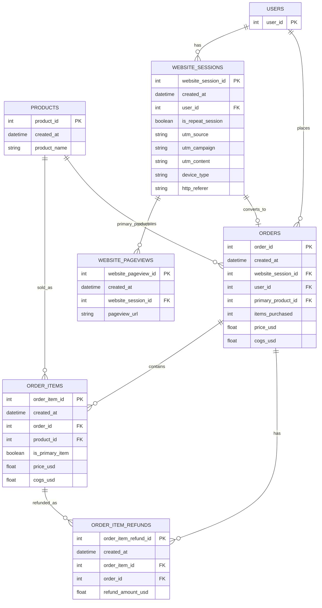

```mermaid
erDiagram

    PRODUCTS {
        int product_id PK
        datetime created_at
        string product_name
    }

    USERS {
        int user_id PK
    }

    WEBSITE_SESSIONS {
        int website_session_id PK
        datetime created_at
        int user_id FK
        boolean is_repeat_session
        string utm_source
        string utm_campaign
        string utm_content
        string device_type
        string http_referer
    }

    WEBSITE_PAGEVIEWS {
        int website_pageview_id PK
        datetime created_at
        int website_session_id FK
        string pageview_url
    }

    ORDERS {
        int order_id PK
        datetime created_at
        int website_session_id FK
        int user_id FK
        int primary_product_id FK
        int items_purchased
        float price_usd
        float cogs_usd
    }

    ORDER_ITEMS {
        int order_item_id PK
        datetime created_at
        int order_id FK
        int product_id FK
        boolean is_primary_item
        float price_usd
        float cogs_usd
    }

    ORDER_ITEM_REFUNDS {
        int order_item_refund_id PK
        datetime created_at
        int order_item_id FK
        int order_id FK
        float refund_amount_usd
    }

    %% Relationships
    USERS ||--o{ WEBSITE_SESSIONS : has
    USERS ||--o{ ORDERS : places

    WEBSITE_SESSIONS ||--o{ WEBSITE_PAGEVIEWS : generates
    WEBSITE_SESSIONS ||--o| ORDERS : converts_to

    ORDERS ||--o{ ORDER_ITEMS : contains
    PRODUCTS ||--o{ ORDER_ITEMS : sold_as

    PRODUCTS ||--o{ ORDERS : primary_product

    ORDER_ITEMS ||--o{ ORDER_ITEM_REFUNDS : refunded_as
    ORDERS ||--o{ ORDER_ITEM_REFUNDS : has
```